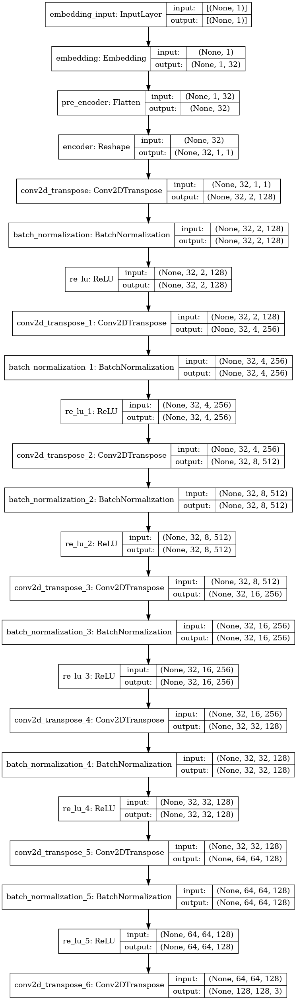
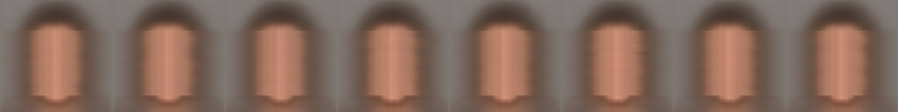
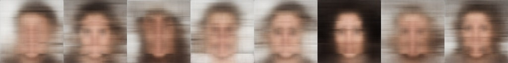
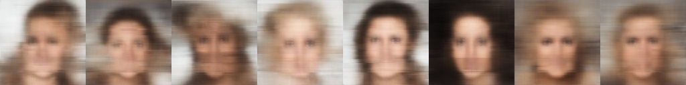
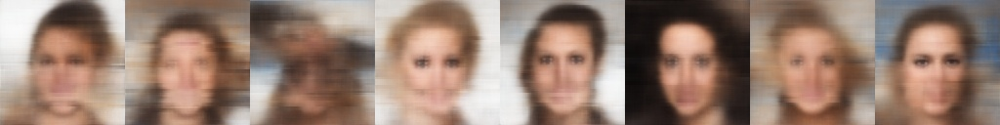
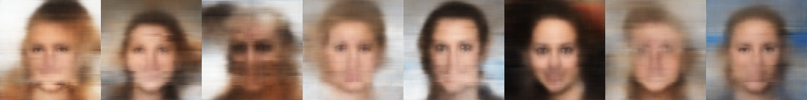
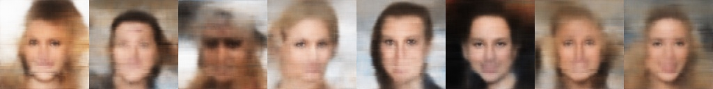
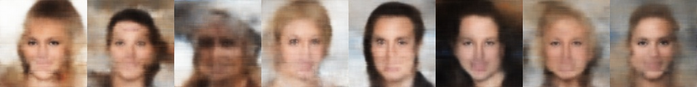
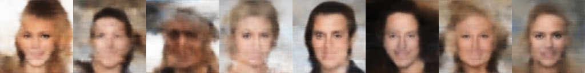

# CelebFace
This a project I've done three years ago and I have just cleaned up the repo/code and moved the model to TensorFlow 2.
It's not being actively maintained however, *I am planning to porting it to an interactive web app soon &mdash; which is exciting.*

This work is entirely based on CodeParade's [work](https://www.youtube.com/watch?v=4VAkrUNLKSo);
I am using a similar model architecture but with deeper latent layers to accomodate the bigger dataset (which also has more variance) &mdash;
this model has approximately 20% more params. It was trained on the [celebA dataset](https://mmlab.ie.cuhk.edu.hk/projects/CelebA.html), 
kindly resized to 128x128 images by [greg](https://www.kaggle.com/datasets/greg115/celebrities-100k).

## MODEL ARCHITECTURE

## RESULTS

These are the generated faces of the same 8 images over every epoch.

##### Epoch 1

##### Epoch 5

##### Epoch 10

##### Epoch 15

##### Epoch 25

##### Epoch 50

##### Epoch 75

##### Epoch 100

